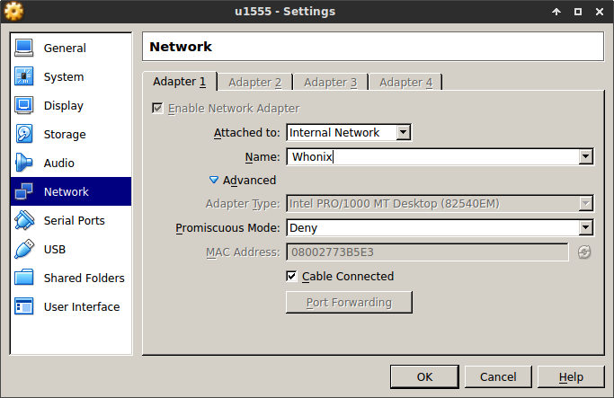
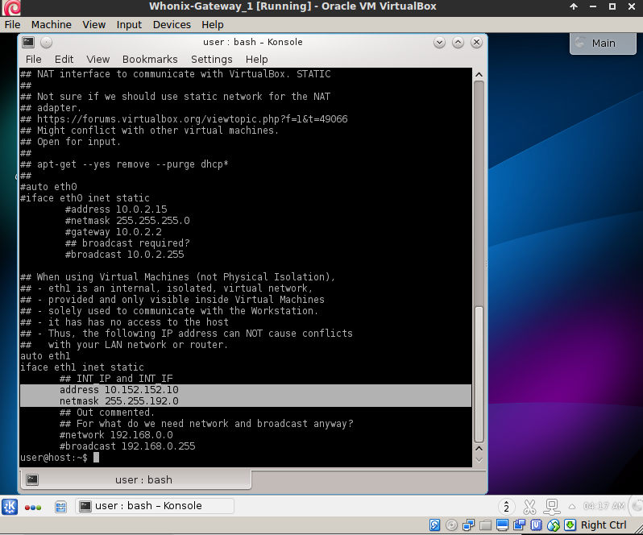

# How to set Xubuntu VM to use TOR whonix gateway

Default [whonix](https://www.whonix.org/) workstation is
based on Debian 32 bit. This is ok for most cases. However, the 32bit version
of Debian may limit some uses. For example, its difficult to use
[Monero](https://getmonero.org/) on a 32-bit Linux. Monero works best
with 64-bit operating systems. Also some people may night be big fans of Debain,
and would like to use something else, such as Ubuntu 15.10. For use in VM,
Xubuntu would be better because xfce is much lighter than Unity.

This example shows how to set-up Xubuntu 15.10 x64 in a VirtualBox so that it
goes through Whonix Tor gateway. 

Please be aware, that not using official
workstation may reduce your security and anonymity, and if you want highest
level of privacy, just stick with the official Whonix workstation! 
Dont follow this example if you are extra paranoid.

The steps here were executed on Ubuntu 14.04 x64 and VirtualBox 5.0.10.


The steps here are based on those described [here](https://www.whonix.org/wiki/Ubuntu).


## Step 1: Download Whonix Gateway VritualBox and Xubuntu images

For Whonix, go to the Whonix [download website](https://www.whonix.org/wiki/Download)
and download the latest workstation image. At the moment of writing this,
 it is `Whonix-Gateway-12.0.0.3.2.ova`.

 For Ubuntu, download `xubuntu-15.10-desktop-amd64.iso` from Xubuntu's [download
 page](http://xubuntu.org/getxubuntu/).


 ## Step 2: Import Whonix workstation to VirtualBox.

  - In VirtualBox Manager: `File->Import Appliance`
  - locate the `Whonix-Gateway-12.0.0.3.2.ova` downloaded
  - follow the prompts to import the image.

## Step 3: Install Xubuntu in the VirtualBox

  - `Machine->New` and follow the prompts. I recommend at least 2GB of ram
     and at least 25 GB of disc space, if you plan to use latest monero in
     the VirtualBox.       
  - Install Xubuntu as you would normally do it.
  - Install any software you need now (stuff needed to compile latest monero), 
   before connecting the Xubuntu to the Whonix gateway. Its much faster now, than updating 
   and install everything through tor.
  - You can also install guest additions. But again, using non offical Whonix 
  workstation can reduce your security.   


## Step 4: Change Xubuntu's network to use Whonix network.

 - `Machine->Settings->Network` and change Adapter 1 from NAT into Internal Network.
 - Make sure that the Name is Whonix.



## Step 5: Remove dhcp auto-configuraion packages from Xubuntu.

You can make VirtualBox snapshot here, just in case something does not work later on,
and you would like to undo the changes.

```bash
sudo apt-get remove isc-dhcp-client isc-dhcp-common network-manager network-manager-gnome resolvconf
```
## Step 6: Check the Whonix Gateway IP and network subnet.

Start the Whonix Gateway and follow the prompts. Once done, check the gateway IP address and network mask. 
I used the following command:

```bash
cat /etc/network/interfaces.d/30_non-qubes-whonix
```




## How can you help?

Constructive criticism, code and website edits are always good. They can be made through github.

Some Monero are also welcome:
```
48daf1rG3hE1Txapcsxh6WXNe9MLNKtu7W7tKTivtSoVLHErYzvdcpea2nSTgGkz66RFP4GKVAsTV14v6G3oddBTHfxP6tU
```    
